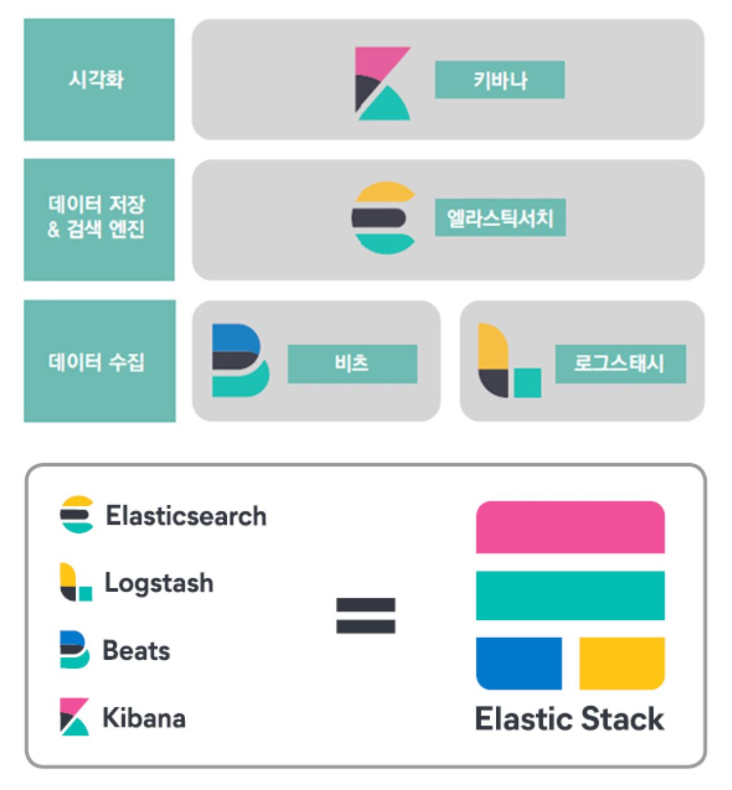

# 1장 엘라스틱 스택이란
---

> 엘라스틱 스택은 일반적인 빅데이터 파이프라인을 구성하기 위한 데이터 수집, 가공, 저장, 분석, 시각화에 필요한 모든 소프트웨어를 갖추고 있다.

- 비츠, 로그스태시 : 데이터 수집과 가공
- 엘라스틱서치 : 데이터 저장과 분석
- 키바나 : 엘라스틱서치에 저장된 데이터를 시각화하고 모니터링

### 

### 엘라스틱 서치: 분산 검색 엔진

---

- 검색 엔진이자 데이터 베이스(일종의 No SQL)이다.
- 모든 레코드를 JSON 도큐먼트 형태로 입력하고 관리
  - 쿼리한 결과에 대해 일치하는 원본 도큐먼트 반환
- 인덱싱
  - 텍스트나 도큐먼트는 인덱싱 시점에 분석을 거쳐 용어 단위로 분해되고 역인덱스 사전을 구축한다.
  - 숫자나 키워드 타입의 데이터들은 엘라스틱서치 집계를 위해 자료구조를 저장한다.
- 검색어에 대한 유사도 스코어를 기반으로 한 정렬을 제공한다.
- 모든 통신을 REST API를 이용하도록 만들어서 프로그래밍 언어와 무관하게 만들었다.
- 단점
  - 시스템 리소스를 많이 사용
  - DSL(Domain Specific Language) 쿼리 사용 : JOIN 쿼리가 어려워 반정규화를 기본으로 모델링 해야한다
  - 인덱스가 불변의 자료구조라서 도큐먼트 삭제 또는 수정 시 비용이 저렴하지 않다.

### 키바나: 시각화와 엘라스틱서치 관리 도구

---

- 가장 중요한 기능 : 시각화와 대시보드
  - 시각화 요소 : 라인 차트, 파이 차트 등과 테이블, 지도 등을 제공
  - 대시보드 : 시각화 요소를 마음대로 배치하고 실시간으로 업데이트 할 수 있는 기능
- 지원 기능들
  - 엘라스틱서치에 대한 대부분의 관리 기능
  - api를 실행할 수 있는 콘솔
  - 솔루션 페이지들(로그, APM, SIEM 등)
  - 스택의 각 구성요소들을 위한 모니터링 페이지 

### 로그스태시: 이벤트 수집과 정제를 위한도구

---

> 로그스태시는 형식에 무관하게 데이터를 동적으로 수집, 변환, 전송하는 구조
>
> 비구조적인 데이터에서 구조를 도출하며, IP 주소에서 위치 정보 좌표로 해독하고 민감한 필드를 익명화하거나 제외시키는 등의 전반적인 작업을 쉽게 해준다.

- 데이저 수집과 가공 기능 제공 : 로그, 메트릭, 웹 애플리케이션 등으로부터 로그 수집 가능
- 필터 기능 제공
  - 비정형 또는 반정형 데이터를 분석하기 쉬운 형태로 정제 가능
  - 엘라스틱서치 외 다양한 플랫폼으로 정제된 데이터를 내보낼 수 있다.
- 설정의 대부분은 플러그인 방식으로 확장성이 좋다.
- 엘라스틱서치의 인덱싱 성능을 최적화하기 위한 배치 처리와 병렬 처리가 가능
- 영속적인 큐를 사용해 현재 처리 중인 이벤트의 최소 1회 전송을 보장한다.
- 부하 상황에서도 안정성 보장.

### 비츠: 엣지단에서 동작하는 경량 수집 도구

---

- 데이터 수집을 위해 용도별로 최적화된 경량 에이전트이며, 특성과 성격에 맞는 다양한 비츠들이 있다.
  - 오딧비트, 메트릭비트, 파일비트, 패킷비트, 하트비트, 윈로그비트

### 엘라스틱 스택의 용도

---

##### 1. 전문 검색 엔진

- 전문(full text) : 단순한 문장부터 뉴스 기사나 논문 등 다양한 글의 전체 내용
- 역인덱싱 기법 활용 : 전문을 용어 단위로 분석해 인덱싱해두고 이를 기반으로 검색을 수행

##### 2. 로그 통합 분석

- 패턴을 기반으로 원문을 가공해 반정형의 텍스트 메시지로부터 정형화된 수치 등의 정보를 뽑아내어 인덱싱하는 방식으로 다양한 방식으로 로그 분석을 한다.
- 인덱스 패턴을 이용해 한번에 여러 인덱스에서 동시에 조회하는 교차 분석이나 연관 분석이 가능하다.
  - 동시간의 각기 다른 서비스들의 로그를 분석해서 문제의 원인 파악이 가능하도록 돕는다.

##### 3. 보안 이벤트 분석

- 엔드포인트 활동, 인증 로그 등에서 이상 징후, 불법적인 로그인 시도, 사용자 패턴 등의 문제를 빠르게 찾아낼 수 있고 탐지 규칙 관리도 가능하다.
- 머신러닝을 이용한 이상 징후 탐지 가능

##### 4. 애플리케이션 성능 분석

- 언어별 에이전트를 통해 성능 지표 수집을 돕고 분석을 위한 UI를 제공한다.
- 단순 모니터링을 넘어 장애나 이상 상황을 빠르게 파악하고 원인을 효과적으로 분석할 수 있다.

##### 5. 머신러닝

- 유료....
  - 데이터를 엘라스틱서치에 넣고 비지도형 머신러닝 기법을 활용해 데이터 패턴 발견 가능
  - 시계열 모델링은 시간과 관련된 데이터에서 이상 징후를 탐지하고 과거 데이터를 기반으로 동향을 예측하게 도와준다.

##### 6. 빅데이터 플랫폼

- 아파치 카프카 연동
- 하둡 연동
- 관계형 데이터베이스 연동

### 유사 제품과의 비교

---

#### 엘라스틱서치의 유사 제품군

|             | 엘라스틱서치                             | 몽고디비                       | MySQL                |
| ----------- | ---------------------------------------- | ------------------------------ | -------------------- |
| 분류        | 검색 엔진                                | 도큐먼트 저장소                | 관계형 데이터베이스  |
| 최초 릴리스 | 2010년                                   | 2009년                         | 1995년               |
| 스키마      | 자동 생성                                | 자유                           | 필요                 |
| 인터페이스  | REST API                                 | 전용 프로토콜                  | JDBC/ODBC            |
| 분산 저장   | 샤딩                                     | 샤딩                           | 별도 제품으로 지원   |
| 트랜잭션    | 미지원                                   | 부분 지원                      | 지원                 |
| JOIN        | 미지원                                   | 최근 도큐먼트 단위로 지원 시작 | 지원                 |
| 특징        | 다양한 데이터 유형에 대한 빠른 검색/집계 | 높은 활용성/범용성             | 뛰어난 데이터 무결성 |

#### 로그스태시/비츠의 유사 제품군

- 로그스태시 vs 플루언트디
  - 플루언트디는 로그스태시와 설정의 형태만 다를 뿐 기능상으론 거의 동일한 역할을 수행할 수 있다.
  - 플루언트디는 CNCF 스택이며 쿠버네티스나 OpenTracing을 사용하는 경우에 사실상 필수 구성요소이다.
- 비츠 vs Exporter(책에는 없음)
  - 쿠버네티스 환경에서 Prometheus를 사용할 때 비츠처럼 모니터링 대상의 데이터를 수집하는 역할(node exporter, cAdvisor, mysql-exporter 등 이 있음)

#### 키바나의 유사 제품군

|                | 키바나                                                       | 그라파나                                                     | 태블로                                                       |
| -------------- | ------------------------------------------------------------ | ------------------------------------------------------------ | ------------------------------------------------------------ |
| 실행 환경      | 웹 서비스                                                    | 웹 서비스                                                    | 설치/웹 서비스 모두 제공                                     |
| 데이터 소스    | 엘라스틱서치                                                 | 엘라스틱서치, 그라파이트(Graphite), 몽고디비, 프로메테우스(Prometheus) 등 | 관계형 데이터베이스, 엑셀 파일, JSON 파일, 드롭박스 등       |
| 특징           | 실시간 대시보드 외에도 캔버스, 지도, 비츠/로그스태시와 연계되어 제공되는 솔루션 등 엘라스틱서치의 기능을 십분 활용한 다양한 시각화 세트 제공 | 라인, 바 차트 등 기본적이지만 인프라 모니터링에 부족함이 없는 시각화 요소들을 포함한 실시간 대시보드 제공 | 실시간보다는 다양한 시각화 도구를 이용한 분석에 특화되어 있음. 다양한 데이터 소스를 활용한 시각화 가능 |
| 기타 기능 지원 | 스택 관리, 모니터링 등 엘라스틱 스택 특화 기능 지원. 알림이나 머신러닝 등 유료 기능 존재 | 알림 기능 지원                                               |                                                              |

#### 엘라스틱 스택의 유사 제품군

- 스플렁크(Splunk)라는 대용량 로그 분석을 위한 엔터프라이즈 제품이 존재하며, 엘라스틱 스택 그 자체와 대응되는 제품이다.

#### 체계적인 문서화와 활발한 공동체 지원

- [공식 문서](https://www.elastic.co/guide/index.html)
- [공식 블로그](https://www.elastic.co/kr/blog) (한국어 지원!)
- 간단한 궁금증은 [스택오버플로우](https://stackoverlow.com)
- [엘라스틱 포럼](https://discuss.elastic.co)

출처 

- 엘라스틱 스택 개발부터 운영까지 책 1장

- [엘라스틱 스택 개발부터 운영까지 홈페이지](https://www.onlybook.co.kr/entry/elasticstack )
- [반정규화(Denormalization)](https://lipcoder.tistory.com/337) 

