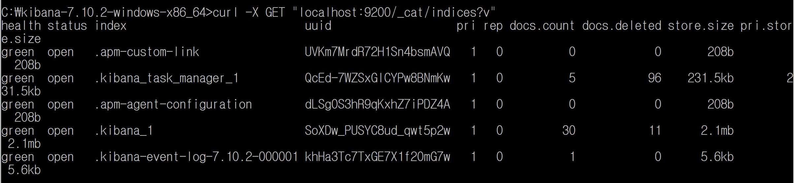
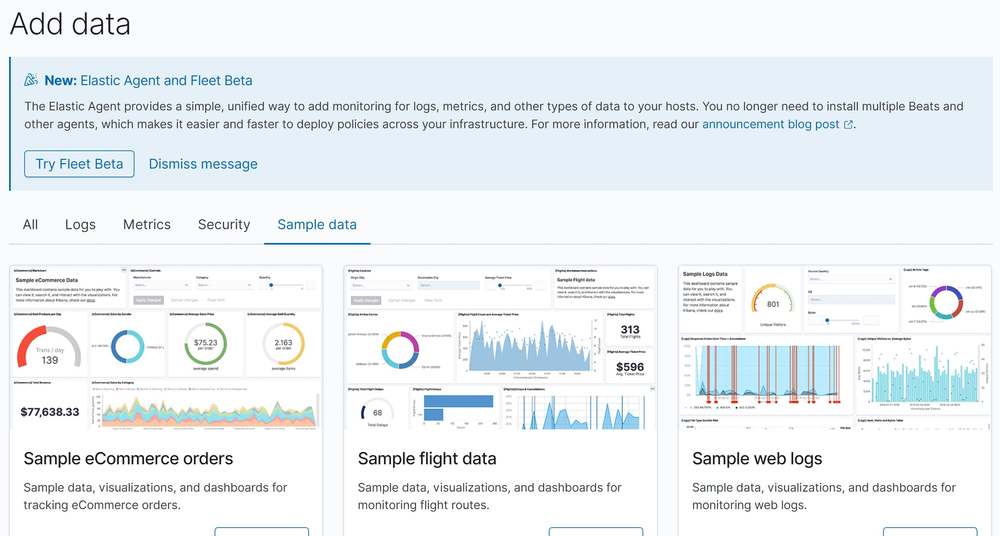
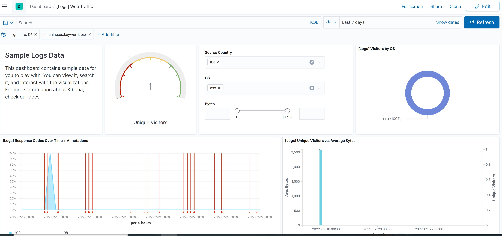

# 3장. 엘라스틱서치 기본

---

- 저장
  - 스키마 구성, 데이터 집어넣기
    - 데이터 타입, 전문 검색 내부 동작 방식
- 인출 방식
  - 검색과 집계


인덱스

도큐먼트

- 생성/읽기/수정/삭제

매핑(스키마 개념)

템플릿 설정 방법 : 복수의 인덱스를 묶어서 관리하는 방법

분석기 : 전문 검색을 위해 문자열을 나누는 작업을 수행


### 3.1 준비작업

---

#### 3.1.1 엘라스틱서치 요청과 응답

> 엘라스틱서치는 모든 요청과 응답을 REST API 형태로 제공한다.
>
> > REST란? 웹상의 모든 리소스에 URI를 부여하고 활용하는 아키텍처


위에 그림은 별다른 설치없이 키바나 콘솔 화면에서 REST API를 이용하여 엘라스틱서치에 조회한 결과이다.

키바나 콘솔 화면에서는 자동완성을 제공하고 문법이 올바른지 검사해부는 구문 검사도 해준다.


#### 3.1.3 시스템 상태 확인

엘라스틱서치의 현재 상태를 빠르게 확인할 수 있는 방법으로 일반적으로 `cat API`를 사용한다. 

cat은 'compact and aligned text'의 약어다.


위의 GET _cat 과 다르게 인덱스목록을 조회한 REST API에는 뒤에 ?v가 붙었다.

윈도우 명령 프롬프트에서 curl -X GET "localhost:9200/_cat/indices?v"를 실행해도 같은 결과가 나온다.



? 뒤에 올 수 있는 파라미터는?

- v : 컬럼의 이름(컬럼 헤더)을 확인할 수 있다.
- s : 정렬
- h : 헤더

등이 존재한다.

cat API를 통해서 인덱스 외에도 클러스터의 노드 정보, 샤드 정보 등도 확인해 볼 수 있다.


#### 3.1.4 샘플 데이터 불러오기

HOME에서 `Try our sample data` 클릭시 아래와 같은 화면이 나오고 Add data 버튼을 클릭하면 샘플이 추가되고, 추가된 후 나타나는 Remove 버튼을 누르면 샘플 데이터가 삭제된다. 샘플 데이터 추가시 키바나의 Visualize와 Dashboard 등에도 샘플들이 함께 추가된다.







### 3.2 인덱스와 도큐먼트

---

일반적으로 엘라스틱을 이용해 시스템을 개발하면 하나의프로젝트에서 하나의 클러스터를 생성한다. 그리고 클러스터 내부는 데이터 성격에 따라 여러 개의 인덱스를 생성한다. 인덱스 내부에는 JSON 형태로 된 다수의 도큐먼트가 존재하고 도큐먼트는 복수의 필드를 갖는다.

#### 3.2.1 도큐먼트

도큐먼트란? 

- 엘라스틱서치에서 데이터가 저장되는 기본 단위
- JSON 형태
- 하나의 도큐먼트는 여러 필드와 값을 갖는다.

아래와 같은 형태의 데이터가 있다고 가정해보자

```
name: mike
age: 25
genger: male
```

MySQL에서 다음과 같이 테이블을 생성하고 쿼리문을 이용해 데이터를 저장한다.

```sql
CREATE TABLE member (
	uid int not null AUTO_INCREMENT PRIMARY KEY,
	name varchar(50) not null,
	age int not null,
	gender varchar(6) not null
);

INSERT INTO member (name, age, gender) values ("mike", 25, "male");
```

member라는 테이블에 name, age, gender라는 컬럼을 가진 스키마가 있어야하고, 하나의 레코드로 데이터를 저장한다.

 여기다가 mariaDB 실행 결과 사진 붙여넣기!

반면, 엘라스틱서치는 테이블을 JSON 형태로 저장한다.

```json
{
    "name": "mike",
    "age": 25,
    "gender": "male"
}
```

엘라스틱 서치에서는 name, age, gender를 필드라고 하며 `"mike", 25, "male"`를 값이라고 한다. 아직 매핑을 배우지 않았지만 엘라스틱서치 매핑으로 필드들의 데이터 타입을 지정할 수 있는데 name, gender 필드는 텍스트 타입, age 필드는 정수 타입으로 매핑이 되었다.

| MySQL  | 엘라스틱서치 |
| ------ | ------------ |
| 테이블 | 인덱스       |
| 레코드 | 도큐먼트     |
| 컬럼   | 필드         |
| 스키마 | 매핑         |

> 참고로 엘라스틱서치 7.x 이전 버전에서는 타입이 존재해서 **테이블 = 타입**으로도 비교 했었는데 7.x 이후 버전부터 타입이 사라졌다.


#### 3.2.2 인덱스