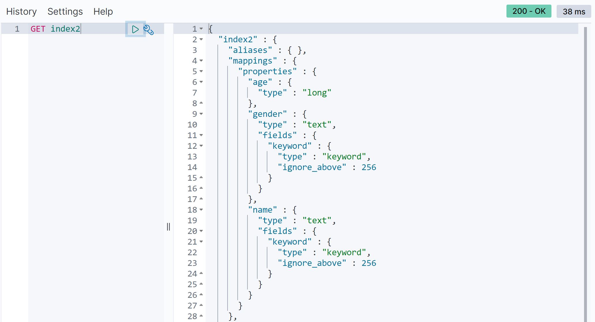

# 3장. 엘라스틱서치 기본

### 3.1 준비작업

---

#### 3.1.1 엘라스틱서치 요청과 응답

> 엘라스틱서치는 모든 요청과 응답을 REST API 형태로 제공한다.
>
> > REST란? 웹상의 모든 리소스에 URI를 부여하고 활용하는 아키텍처


위에 그림은 별다른 설치없이 키바나 콘솔 화면에서 REST API를 이용하여 엘라스틱서치에 조회한 결과이다.

키바나 콘솔 화면에서는 자동완성을 제공하고 문법이 올바른지 검사해부는 구문 검사도 해준다.


#### 3.1.3 시스템 상태 확인

엘라스틱서치의 현재 상태를 빠르게 확인할 수 있는 방법으로 일반적으로 `cat API`를 사용한다. 

cat은 'compact and aligned text'의 약어다.


위의 GET _cat 과 다르게 인덱스목록을 조회한 REST API에는 뒤에 ?v가 붙었다.

윈도우 명령 프롬프트에서 curl -X GET "localhost:9200/_cat/indices?v"를 실행해도 같은 결과가 나온다.


? 뒤에 올 수 있는 파라미터는?

- v : 컬럼의 이름(컬럼 헤더)을 확인할 수 있다.
- s : 정렬
- h : 헤더

등이 존재한다.

cat API를 통해서 인덱스 외에도 클러스터의 노드 정보, 샤드 정보 등도 확인해 볼 수 있다.


#### 3.1.4 샘플 데이터 불러오기

HOME에서 `Try our sample data` 클릭시 아래와 같은 화면이 나오고 Add data 버튼을 클릭하면 샘플이 추가되고, 추가된 후 나타나는 Remove 버튼을 누르면 샘플 데이터가 삭제된다. 샘플 데이터 추가시 키바나의 Visualize와 Dashboard 등에도 샘플들이 함께 추가된다.


### 3.2 인덱스와 도큐먼트

---

일반적으로 엘라스틱을 이용해 시스템을 개발하면 하나의프로젝트에서 하나의 클러스터를 생성한다. 그리고 클러스터 내부는 데이터 성격에 따라 여러 개의 인덱스를 생성한다. 인덱스 내부에는 JSON 형태로 된 다수의 도큐먼트가 존재하고 도큐먼트는 복수의 필드를 갖는다.

#### 3.2.1 도큐먼트

도큐먼트란? 

- 엘라스틱서치에서 데이터가 저장되는 기본 단위
- JSON 형태
- 하나의 도큐먼트는 여러 필드와 값을 갖는다.

아래와 같은 형태의 데이터가 있다고 가정해보자

```
name: mike
age: 25
genger: male
```

MySQL에서 다음과 같이 테이블을 생성하고 쿼리문을 이용해 데이터를 저장한다.

```sql
CREATE TABLE member (
	uid int not null AUTO_INCREMENT PRIMARY KEY,
	name varchar(50) not null,
	age int not null,
	gender varchar(6) not null
);

INSERT INTO member (name, age, gender) values ("mike", 25, "male");
```

member라는 테이블에 name, age, gender라는 컬럼을 가진 스키마가 있어야하고, 하나의 레코드로 데이터를 저장한다.

 여기다가 mariaDB 실행 결과 사진 붙여넣기!

반면, 엘라스틱서치는 테이블을 JSON 형태로 저장한다.

```json
{
    "name": "mike",
    "age": 25,
    "gender": "male"
}
```

엘라스틱 서치에서는 name, age, gender를 필드라고 하며 `"mike", 25, "male"`를 값이라고 한다. 아직 매핑을 배우지 않았지만 엘라스틱서치 매핑으로 필드들의 데이터 타입을 지정할 수 있는데 name, gender 필드는 텍스트 타입, age 필드는 정수 타입으로 매핑이 되었다.

| MySQL  | 엘라스틱서치 |
| ------ | ------------ |
| 테이블 | 인덱스       |
| 레코드 | 도큐먼트     |
| 컬럼   | 필드         |
| 스키마 | 매핑         |

> 참고로 엘라스틱서치 7.x 버전부터 타입(type)은 더 이상 사용되지 않는다. 
>
> 타입이 존재했을 때는 **테이블 = 타입**으로도 비교 했었다.


#### 3.2.2 인덱스

인덱스란?

- 도큐먼트를 저장하는 논리적 단위
- RDB의 테이블과 유사한 개념
- 하나의 인덱스에 다수의 도큐먼트가 포함되는 구조
  - 동일한 인덱스에 있는 도큐먼트는 동일한 스키마를 갖는다.
  - 모든 도큐먼트는 반드시 하나의 인덱스에 포함돼야 한다.
- 인덱스 이름에는 영어 소문자를 비롯해, `\, /, *, ?, ", <, >, |, #, 공백, 쉼표 등을 제외한 특수문자`를 사용할 수 있으며 255 바이트를 넘을 수 없다.


> ##### 스키마에 따른 그룹핑

일반적으로 스키마에 따라 인덱스를 구분한다. 

예를 들어, 회원 정보 도큐먼트와 장바구니 도큐먼트는 성격이 다르기 때문에 데이터 스키마도 다르다. 이렇게 서로 다른 스키마를 가진 도큐먼트를 하나의 인덱스에 저장하는 방법은 바람직하지 않다. **스키마에 따라 인덱스를 구분하는 것은 기본이며 필수적인 사항**이다. 


> ##### 관리 목적의 그룹핑

기본적으로 인덱스는 용량이나 숫자 제한 없이 무한대의 도큐먼트를 포함할 수 있다.  이론적으로는 하나의 인덱스에 수억 개의 도큐먼트도 저장될 수 있다. 하지만 인덱스가 커지만 검색 시 많은 도큐먼트를 참조해야하기 때문에 성능이 나빠진다. 그래서 **엘라스틱서치를 운영하면 인덱스 용량 제한**을 두게 된다. 

 기본적으로 특정 도큐먼트 개수에 도달하거나 특정 용량을 넘어서면 인덱스를 분리한다. 혹은 일/주/월/년 단위 같은 날짜/시간 단위로 인덱스를 분리하기도 한다. 이렇게 분리해두면 분리해둔 기준으로 인덱스를 삭제 가능해진다. 즉, 빅데이터 시스템은 데이터가 커서 디스크 용량이 부족해지거나 시스템 가용성 차원에서 데이터 정제 작업이 많은데, 이를 효율적으로 처리하기 위해 데이터를 관리 목적으로 그루핑하는 경우가 많다.


### 3.3 도큐먼트 CRUD

#### 3.3.1 인덱스 생성/확인/삭제


#### 3.3.2 도큐먼트 생성

엘라스틱서치에서 도큐먼트를 인덱스에 포함시키는 것을 인덱싱이라고 한다.


index2라는 인덱스를 생성하면서 동시에 index2 인덱스에 도큐먼트를 인덱싱한다. index2는 인덱스 이름, _doc은 엔드포인트 구분을 위한 예약어, 숫자 1은 인덱싱할 도큐먼트의 고유 아이디다. 도큐먼트에는 age, gender, name이라는 필드가 있고 각 필드에는 값이 있다.



위 사진은 GET API를 통해서 index2 인덱스 설정값을 알아오는 화면인데, 캡쳐다 보니까 아래 내용들이 짤려있다.

mappings를 자세히 확인해보면 age는 long type, gender와 name은 text type으로 필드가 지정되어있다. 우리가 데이터 타입을 지정하지 않아도 엘라스틱서치는 도큐먼트의 필드와 값을 보고 자동으로 지정하는데, 이런 기능을 **다이내믹 매핑**이라고 한다.

이번에는 index2 인덱스에 country라는 이름의 새로운 필드가 추가된 도큐먼트를 인덱싱해보자


1번에 인덱싱한 도큐먼트의 필드와 완전히 동일하지 않지만 문제없이 인덱싱이 된다. 이번에는 데이터 타입을 잘못 입력한 도큐먼트를 인덱싱 해보자.


오류없이 잘 저장되었다. RDB라면 오류가 발생했겠지만, 스키마에 유연하게 대응하는 엘라스틱서치는 타입을 변환해 저장한다.

엘라스틱서치는 혹시 모를 사용자 입력 실수를 고려해 자동으로 데이터 형변환을 진행한다. 대표적인 형변환 규칙은 다음과 같다.

- 숫자 필드에 문자열이 입력되면 숫자로 변환을 시도한다. ex) "age": "10" -> 10
- 정수 필드에 소수가 입력되면 소수점 아래 자리를 무시한다. ex) "age": 10.0 -> 10

#### 3.3.3 도큐먼트 읽기

예제는 `GET index2/_doc/1`이였지만, 데이터 타입을 잘못 입력한 도큐먼트 인덱싱 결과가 궁금해서 `GET index2/_doc/3` 으로 조회해보았다. 실제로 조회해보니 입력한 그대로 저장되어있다. 도큐먼트 아이디 1을 조회했을 때는 숫자 "age" : 25 로 결과가 나왔었다.


엘라스틱 search DSL 쿼리를 사용하면 index2 인덱스 내의 모든 도큐먼트를 가져온다.


#### 3.3.4 도큐먼트 수정

index2 인덱스의 1번 도큐먼트의 특정 필드값을 변경해보자.


"result" :  "updated" 이 값을 보면 1번 도큐먼트의 특정 필드값이 변경되었음을 나타난다. 또한 *_version 이랑 _seq_no 도 변경되었다.*

응답 결과의 result를 통해 도큐먼트가 생성/업데이트/삭제되는 상태를 알 수 있다. update API를 이용해서도 특정 도큐먼트의 값을 업데이트할 수도 있다.


#### 3.3.5 도큐먼트 삭제


이렇게 result를 통해 deleted, 즉 삭제되었음을 알 수 있다.

**단, 도큐먼트 수정과 마찬가지로 개별 도큐먼트 삭제 또한 비용이 많이 들어가는 작업인 만큼 사용 시에 주의하자.**


### 3.4 응답 메시지

| 코드     | 상태                                      | 해결 방법                           |
| -------- | ----------------------------------------- | ----------------------------------- |
| 200, 201 | 정상적으로 수행함                         |                                     |
| 4xx      | 클라이언트 오류                           | 클라이언트에서 문제점 수정          |
| 404      | 요청한 리소스가 없음                      | 인덱스나 도큐먼트가 존재하는지 체크 |
| 405      | 요청 메소드(GET, POST 등)을 지원하지 않음 | API 사용법 다시 확인                |
| 429      | 요청 과부화(busy)                         | 재전송, 노드 추가 같은 조치         |
| 5xx      | 서버 오류                                 | 엘라스틱서치 로그 확인 후 조치      |


### 3.5 벌크 데이터

엘라스틱서치에서는 벌크(bulk) API를 이용해 여러 도큐먼트의 CUD 동작을 한번에 요청할 수 있다. (읽기 미지원)
벌크 데이터 포맷을 보면 삭제만 한 줄로 작성하고 나머지(index, create, update) 작업들은 두 줄로 작성된다.

각 줄 사이에는 쉼표 등 별도의 구분자가 없고 라인 사이 공백(빈 줄)을 허용하지 않는다.
`복수의 JSON 구조를 줄바꿈 문자열로 구분하는 NDJSON(New-line Delimited JSON, ndjson.org) 형태`이다. (JSON이랑 문법이 조금 다르다)

### 3.6 매핑
RDB의 스키마와 비슷한 역할을 하는 것이 엘라스틱서치에서는 **매핑**이다.

#### 3.6.1 다이내믹 매핑
엘라스틱서치에서 데이터 형식에 맞게 알아서 매핑

#### 3.6.2 명시적 매핑
직접 사용자가 지정

#### 3.6.3 매핑 타입

